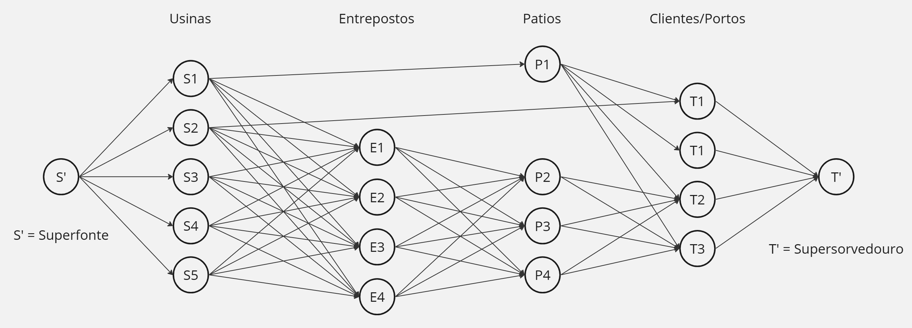
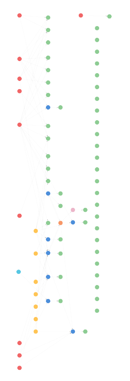
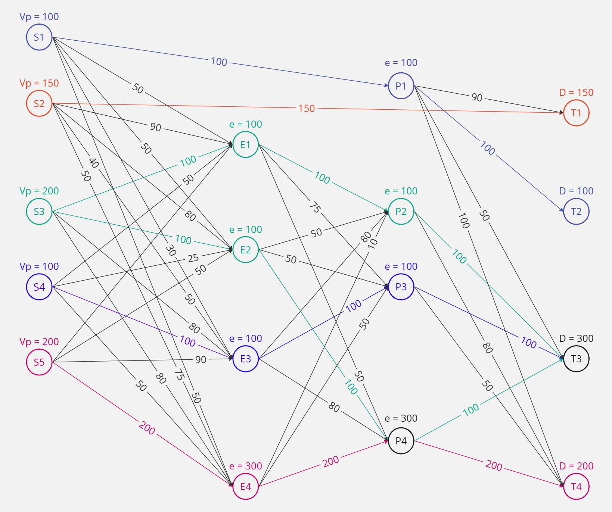
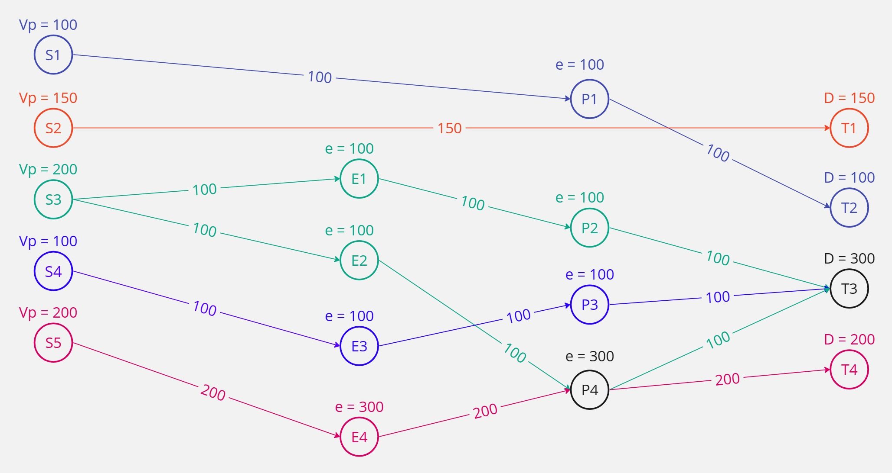

# Entendimento do contexto do problema: modelagem e representação

## 1. Introdução

&emsp;&emsp;De acordo com um trecho de um PDF, fornecido pela UNICAMP, "A modelagem matemática é uma técnica de representação quantitativa de processos e problemas reais."[1]. A modelagem matemática conta com três etapas principais, sendo elas: definição de qual a tomada de decisão para o problema, criação dos objetivos que se desejam atingir com a solução (sendo a maximização ou minimização de algo) e, por fim, a definição das restrições do problema, o que garante a integridade do sistema e a coerência de seu funcionamento. Com isso, nota-se a importância da modelagem matemática e representação de problemas, já que garante a compreensão eficiente do que precisa ser resolvido, resultando em uma solução mais precisa e personalizada.

&emsp;&emsp;No contexto do projeto em questão, a modelagem matemática e representação em grafo tornam-se processos essenciais. Os dados disponibilizados apresentam informações do fluxo de produtos da Vale, os locais por onde passam, estoques aonde ficam armazenados, seus clientes de destino, além de outras específicas para o desafio proposto. Cada um dos dados citados pode compor um grafo mediante representação em nós, arestas e propriedades, sendo essa forma a maneira mais eficiente de solucionar o problema proposto pelo cliente, a maximização do volume de produtos entregues pela Vale para seus respectivos compradores. Tanto a representação como a modelagem serão ferramentas essenciais para visualizar o problema, mapear decisões, objetivo e restrições que serão seguidas pelo algoritmo de otimização, assim garantindo a construção de uma solução eficiente.

&emsp;&emsp;O fluxo de produtos da Vale apresenta uma estrutura de *supply chain* complexa e profunda. Os produtos originam-se principalmente de usinas de beneficiamento, principal ponto de produção da Vale, em seguida, podem seguir uma série de caminhos distintos a depender do que foi pedido pelo cliente, além de suas propriedades e respectivas quantidades. Os principais pontos pelos quais os produtos podem passar após as usinas são os entrepostos, patios diversos e seus respectivos clientes e/ou meio pelos quais os produtos serão levados até os mesmos. Com um fluxo de dados tão complexo, é de suma importância que meios para otimizar o fluxo dos materiais sejam desenvolvidos.

## 2. Representação do problema em grafo

&emsp;&emsp;Como citado anteriormente, a forma mais eficiente de interpretar o problema proposto, que caracteriza-se como um problema de fluxo máximo, é através da representação em grafo. A figura 01 demonstra, de modo simplificado, o grafo do problema.

<br>
<p align="center">
   <b>Figura 01 -</b> Representação do problema em grafo
</p>
   <p align="center">
      </a>
   </p>
<p align="center">
   Fonte: Elaboração ValeMax (2024)
</p>
<br>

&emsp;&emsp;Em sua forma mais básica, o fluxo seguido pelos produtos da Vale saem de alguns pontos de origem que, no grafo, foram mapeados como "Usinas" usando como base conversas com os *stakeholders* do projeto e a análise de dados desenvolvida. É válido ressaltar que cada ponto de origem é conhecido como uma "fonte" e é representado por $S_i$, dado o aumento de dificuldade para modelar matematicamente várias fontes, foi criada uma "Superfonte" ($S'$) que resume todas as fontes para apenas um nó, assim simplificando sua modelagem.  

&emsp;&emsp;A partir da fonte, o fluxo pode seguir por rotas distintas, sendo o caminho majoritário que os produtos saiam da fonte, passem por um entreposto, sigam para um pátio e sejam direcionados para seus respectivos clientes. Entretanto, tal trajeto não é uma regra absoluta, podendo variar para a ida do produto direto para o pátio ou mesmo para o cliente. No grafo, todas essas possibilidades foram contempladas de forma simplificada mediante o analisado da base de dados disponibilizada pelo cliente. 

&emsp;&emsp;No esquema, os "Entrepostos" ($E_i$) foram mapeados como uma das possibilidades de caminho para os produto, são locais de organização para que depois ocorra o direcionamento para os próximos nós da cadeia. Ademais, foram mapeados "Patios" ($P_i$), locais por onde os produtos passam para serem redirecionados para seus respectivos destinos. Por fim, os destinos foram caracterizados como "Clientes" devido a explicações fornecidas pela Vale, mas não necessariamente esses pontos são os clientes, para casos internacionais podem ser os portos navais. Da mesma forma que as fontes, existem mais de um "sorvedouros", com isso um "Supersorvedouro" ($T'$) foi criado para facilitar a modelagem.

&emsp;&emsp;É válido ressaltar que a estrutura apresentada foi construída a partir do grafo gerado pelo software *neo4j*, plataforma utilizada para a análise dos dados e construção dos grafos para o projeto. Tal processo foi feito visando ampliar a compreensão dos dados e do problema a ser resolvido.

<br>
<p align="center">
   <b>Figura 02 -</b> Grafo gerado no neo4j
</p>
   <p align="center">
      </a>
   </p>
<p align="center">
   Fonte: Elaboração ValeMax (2024)
</p>
<br>

&emsp;&emsp;O grafo apresentado na figura acima apresenta uma fração dos dados representados como nós e arestas, o conjunto total de informações apresenta 455 nós e 262 relacionamentos. Nota-se que a estrutura apresentada no grafo gerado a partir dos dados segue um padrão próximo ao que foi proposto na modelagem matemática, sendo os nós vermelhos as usinas aonde os produtos são gerados, os nós verdes representam clientes, amarelos representam entrepostos e azuis representam pátios. É válido ressaltar que essa representação é uma fração do grafo total e a construção do modelo matemático foi feita de modo a simplificar a interpretação do problema.

## 3. Modelagem matemática do problema

## 3.1. Tomada de decisão

&emsp;&emsp;A tomada de decisão corresponde a qual decisão o algoritmo tomará dado seu nó. A decisão que precisa ser tomada está na expressão abaixo.

$X_{ij} =$ Volume (em toneladas) que passa entre os nós $i$ e $j$.

## 3.2. Objetivo

&emsp;&emsp;Em um problema de fluxo máximo, é esperado que seja entregue o máximo de volume no destino, conforme destacado na primeira expressão. A segunda expressão é equivalente a anterior, ela representa o máximo de volume que sai da origem, sendo essas duas equivalentes devido ao princípio da conservação do grafo.

$max F = \sum_j{X_{S'S_k}}$

sendo 1 $\le$ k $\le$ K, onde K é a quantidade de usinas (fontes).

ou

$max F = \sum_i{X_{T'T_w}}$

sendo 1 $\le$ w $\le$ W, onde W é a quantidade de clientes (sorvedouros).

## 3.3. Restrições

&emsp;&emsp;Restrições são limitações que serão colocadas para o algoritmo para que casos impossíveis ou não aplicáveis para o problema não aconteçam. Para o caso do problema apresentado, existem duas restrições principais expressas de modo genérico devido o processo da análise de dados ainda estar em um estágio inicial, não sendo possível adicionar restrições mais específicas nesse primeiro momento do projeto.

### 3.3.1. Restrição de conservação

&emsp;&emsp;A restrição de conservação diz respeito ao que entra em um nó ser o mesmo que sairá dele, assim garantindo que o volume que entra e sai de todo o sistema seja o mesmo. A expressão abaixo garante isso de forma genérica, sendo $X_{ik}$ a representação do que entra de cada nó $k$, enquanto $X_{kj}$ é a representação do que sai de cada nó $k$.

$\sum_i{X_{ik}} = \sum_j{X_{kj}}$

### 3.3.1. Restrição de capacidade

&emsp;&emsp;A restrição de capacidade refere-se ao volume que sai de um nó, respeitando a capacidade máxima permitida pela aresta que leva ao próximo nó. Essa capacidade é representada genericamente como $C$, pois ainda é uma incógnita as capacidades específicas de cada aresta.

$X_{ij} \le C_{ij}$

## 4. Solução (Caminho) fáctivel/viável para o problema

&emsp;&emsp;Para representar uma possível solução para o problema apresentado, foi proposto um caminho no grafo com algumas suposições para propriedades que serão necessárias para que o algoritmo chegue em um caminho satisfatório para o problema. A figura 02 demonstra uma visão geral de um caminho que poderia ser selecionado para transportar o máximo de volume dos produtos da Vale da origem para o destino.

<br>
<p align="center">
   <b>Figura 03 -</b> Representação de uma solução viável para o problema (visão geral)
</p>
   <p align="center">
      </a>
   </p>
<p align="center">
   Fonte: Elaboração ValeMax (2024)
</p>
<br>

&emsp;&emsp;Devido à grande quantidade de arestas e informações, o caminho viável foi simplificado para facilitar a visualização da possível solução para o grafo proposto. A figura 04 contém essa visualização mais específica.

<br>
<p align="center">
   <b>Figura 04 -</b> Representação de uma solução viável para o problema (visão específica)
</p>
   <p align="center">
      </a>
   </p>
<p align="center">
   Fonte: Elaboração ValeMax (2024)
</p>
<br>

&emsp;&emsp;A figura demonstra um caso hipotético. A variável "Vp" foi utilizada para representar o "Volume produzido" por cada fonte, cada aresta contém um número que representa sua capacidade máxima, sendo isso uma representação de quanto um transporte hipotético pode levar para o próximo nó. Em seguida, os entrepostos e pátios receberam uma variável "e" que serve para representar a capacidade de estocagem temporária de cada local. Após os produtos passarem pelos entrepostos e pátios, eles seguem para seus respectivos destinos que contém uma variável "D" representando sua demanda no momento. Nota-se que as capacidades são todas respeitadas no fluxo, e o que é produzido é entregue para os clientes, ou seja, todas as restrições estão sendo respeitadas nesse exemplo.

&emsp;&emsp;Tal modelagem matemática ainda pode passar por uma série de melhorias, além de diversos nós que podem ser adicionados e melhor detalhados para modelar problema. Na versão atual, a visualização completa do grafo foi resumida e passada para um caso geral com intuito de melhorar sua compreensão. É esperado que com o desenvolvimento do projeto e maior compreensão dos dados apresentados, esses modelos tornem-se ainda mais robustos para garantir a construção de uma solução eficiente para o desafio proposto.

## 5. Seleção de algoritmos

&emsp;&emsp;No processo de seleção de algoritmos para resolver o problema em questão, optou-se por focar em algoritmos de fluxo máximo devido à natureza do problema apresentado pela Vale. Essa escolha foi baseada na necessidade de otimizar a distribuição de minério de ferro da empresa, o que se enquadra perfeitamente em um problema de fluxo máximo, onde o objetivo é maximizar a quantidade de produto transportado de uma fonte para um destino, respeitando as capacidades das arestas — elementos que conectam os vértices do grafo e através das quais o fluxo é enviado — [2]. A seguir, apresenta-se uma análise dos algoritmos de fluxo máximo selecionados pela Valemax para o desenvolvimento de uma solução de alta performance, utilizando grafos. 

### 5.1. Ford-Fulkerson

&emsp;&emsp;Conhecido também como algoritmo dos pseudocaminhos aumentadores, o algoritmo de Ford-Fulkerson é um dos mais clássicos e amplamente utilizados para resolver problemas de fluxo máximo em grafos. Sua abordagem é baseada em aumentar o fluxo ao longo de caminhos de aumento no grafo, isto é, caminhos que permitem aumentar o fluxo da fonte para o destino. O algoritmo continua encontrando caminhos de aumento e aumentando o fluxo até que não seja mais possível encontrar tais caminhos, momento em que o fluxo máximo é alcançado. Segue a baixo, o pseudocódigo do algoritmo de Ford-Fulkerson para melhor compreensão do seu funcionamento. [3]

**Pseudocódigo do algoritmo de Ford-Fulkerson:**

```
função Atualiza-Grafo-Residual(G, f)
   Para cada aresta a(u,v) em G, , com u,v∈N 
         Se f(a) < ca então // ca é a capacidade de a
            insira aR(u,v) com caR=(ca - f(a))
         Se f(a) > 0 então // Se a aresta tem fluxo
            insira aR(v,u) com caR=f(a) 
   Retorna(GR) 
```

```
função Ford-Fulkerson(G, s, t) 
   Inicia f(a)=0 para cada aresta a de G 
   Defina GR = Atualiza-Grafo-Residual(G, f)
   Enquanto existir caminho de aumento de s para t em GR 
        Seja P um caminho de aumento s-t em GR 
        Defina cP = min{caR : aR∈P}
        Para cada aresta aR em P
            Se aR tem direção s-t então
                 faça [f(a) → f(a) + cP] em G
           Caso contrário
                faça [f(a) → f(a) - cP] em G
        GR = Atualiza-Grafo-Residual(G, f)
  Retorna (f)
```
&emsp;&emsp;Código obtido de: [Wikipedia](https://pt.wikipedia.org/wiki/Algoritmo_de_Ford-Fulkerson) 

&emsp;&emsp;Dessa forma, pode-se observar, através do pseudocódigo, que o algoritmo de Ford-Fulkerson é composto por três etapas principais: [4]

1. **Inicialização:** o algoritmo começa com um fluxo nulo e itera até não ser possível encontrar mais pseudocaminhos aumentadores.
2. **Identificação de Pseudocaminhos Aumentadores:** em cada iteração, busca-se um pseudocaminho aumentador.
3. **Atualização do Fluxo:** uma vez identificado um pseudocaminho aumentador, o algoritmo aumenta o fluxo ao longo deste caminho, ajustando os valores de fluxo nas arestas correspondentes. 

#### Vantagens do Algoritmo de Ford-Fulkerson: [5]

- Simplicidade conceitual e implementação relativamente direta. Fator que pode ser observado no pseudocódigo acima, que é composto por apenas três etapas principais.
- Flexibilidade para lidar com diferentes tipos de grafos e problemas de fluxo.
- Pode ser adaptado para lidar com capacidades de arestas variáveis, permitindo ampla gama de aplicações.

#### Desvantagens do Algoritmo de Ford-Fulkerson: [6]

- Pode ser ineficiente em grafos com capacidades de arestas grandes ou com muitos caminhos de aumento.
- A complexidade de tempo do algoritmo de Ford-Fulkerson é $(O((n + m)C))$, onde $n$ é o número de vértices, $m$ é o número de arestas e $C$ é a capacidade máxima das arestas. Esta complexidade é considerada pseudo-polinomial porque depende do valor da capacidade máxima das arestas, o que significa que o algoritmo pode não garantir um tempo de execução polinomial em todos os casos. 
- O número de iterações $C$ pode ser alto, e em alguns grafos, um grande número de iterações é necessário para encontrar o fluxo máximo. Isso pode tornar o algoritmo ineficiente em certos casos. 
- Em algumas situações, o algoritmo pode não terminar para capacidades reais. Isso geralmente ocorre em grafos com capacidades reais devido a problemas como ciclos de aumento negativos. 

### 5.2. Edmonds-Karp

&emsp;&emsp;Sendo uma variação do algoritmo de Ford-Fulkerson, o algoritmo de Edmonds-Karp é utiliza uma abordagem de busca em largura (BFS) para encontrar caminhos de aumento no grafo. Essa abordagem garante que o caminho de aumento encontrado seja o mais curto possível em termos de número de arestas, o que pode levar a um desempenho mais eficiente em determinados cenários. Ademais, o mesmo possui um final garantido e com um tempo de execução independente do valor do fluxo máximo. [7]

**Pseudocódigo do algoritmo de Edmonds-Karp:** 

```
algorithm EdmondsKarp is
    input:
        graph   (graph[v] should be the list of edges coming out of vertex v in the
                 original graph and their corresponding constructed reverse edges
                 which are used for push-back flow.
                 Each edge should have a capacity 'cap', flow, source 's' and sink 't' 
                 as parameters, as well as a pointer to the reverse edge 'rev'.)
        s       (Source vertex)
        t       (Sink vertex)
    output:
        flow    (Value of maximum flow)
    
    flow := 0   (Initialize flow to zero)
    repeat
        (Run a breadth-first search (bfs) to find the shortest s-t path.
         We use 'pred' to store the edge taken to get to each vertex,
         so we can recover the path afterwards)
        q := queue()
        q.push(s)
        pred := array(graph.length)
        while not empty(q) and pred[t] = null
            cur := q.pop()
            for Edge e in graph[cur] do
                if pred[e.t] = null and e.t ≠ s and e.cap > e.flow then
                    pred[e.t] := e
                    q.push(e.t)

        if not (pred[t] = null) then
            (We found an augmenting path.
             See how much flow we can send) 
            df := ∞
            for (e := pred[t]; e ≠ null; e := pred[e.s]) do
                df := min(df, e.cap - e.flow)
            (And update edges by that amount)
            for (e := pred[t]; e ≠ null; e := pred[e.s]) do
                e.flow  := e.flow + df
                e.rev.flow := e.rev.flow - df
            flow := flow + df

    until pred[t] = null  (i.e., until no augmenting path was found)
    return flow
```
&emsp;&emsp;Código obtido de: [wikipedia](https://pt.wikipedia.org/wiki/Algoritmo_de_Ford-Fulkerson)


&emsp;&emsp;O pseudocódigo do algoritmo de Edmonds-Karp é composto pelas seguintes principais etapas: 

1. **Inicialização:** inicializa o fluxo máximo como zero.
2. **BFS para encontrar caminho mais curto:** utiliza busca em largura (BFS) para encontrar o caminho mais curto da fonte (s) até o destino (t). Isso é feito até que não seja mais possível encontrar caminhos aumentadores.
3. **Aumento do Fluxo**: uma vez encontrado um caminho aumentador, determina quanto fluxo pode ser enviado ao longo do caminho. Atualiza o fluxo ao longo do caminho e seu reverso de acordo.
4. **Repetição**: o processo é repetido até que não seja mais possível encontrar caminhos aumentadores.

### Vantagens do Algoritmo de Edmonds-Karp: [8]

- Garante a identificação de caminhos de aumento mais curtos, o que pode levar a uma convergência mais rápida.
- Mais eficiente em grafos com capacidades de arestas grandes ou com muitos caminhos de aumento.

### Desvantagens do Algoritmo de Edmonds-Karp: [7]

- A implementação pode ser um pouco mais complexa do que o algoritmo de Ford-Fulkerson devido à necessidade de utilizar busca em largura. Tal fator fica evidente na comparação ao pseudocódigo de ambos algoritmos, pois, como observado acima, o pseudocódigo do algoritmo de Edmonds-Karp possui mais etapas e é mais complexo.
- Pode ser menos flexível em certos tipos de grafos em comparação com o algoritmo de Ford-Fulkerson.

&emsp;&emsp;Infere-se, portanto, que ambos os algoritmos selecionados são altamente relevantes para resolver o problema de maximização do fluxo de minério de ferro da Vale. A abordagem de Ford-Fulkerson oferece simplicidade e flexibilidade conceitual, enquanto o Edmonds-Karp se destaca pela eficiência na busca por caminhos de aumento mais curtos. A combinação desses algoritmos permite explorar diferentes estratégias para lidar com diferentes características do grafo e das capacidades de arestas.

## 6. Materiais adicionais

&emsp;&emsp;Como uma forma de ampliar a compreensão sobre os dados disponibilizados pelo cliente, foi construído um arquivo na plataforma Miro que contempla a análise das informações que está sendo desenvolvida pela equipe. Segue o link para visualização como um material adicional para a modelagem matemática e representação do problema:

https://miro.com/welcomeonboard/dUdhMTMyWGF0RnY3OTBUcU9JMVBuV1U3eXJKYTZtdnlma1llZjhtNWFPTGlvRzhPTDVGNFpDM1VITmpoeG80RnwzMDc0NDU3MzY2MjY0MzgyNTY0fDI=?share_link_id=217257741402

## 7. Referências

[1] Capítulo I -Modelagem Matemática CAPÍTULO I -MODELAGEM MATEMÁTICA. [s.l: s.n.]. Disponível em: <https://www.ime.unicamp.br/~moretti/ms428/2sem2010/aula_slides.pdf>. Acesso em: 15 fev. 2024.

[2] Unesp. "Elementos de Teoria dos Grafos - Notas de Aulas". [Unesp](https://www.ibilce.unesp.br/Home/Departamentos/MatematicaAplicada/docentes/socorro/grafos---notas-de-aula_set2018.pdf). Acesso em: 29 fev. 2024.

[3] IME USP. "Algoritmo de Ford-Fulkerson". Disponível em: [IME USP](https://www.ime.usp.br/~pf/algoritmos_para_grafos/aulas/flow-FF.html). Acesso em: 28 fev. 2024.

[4] Unicamp. "Algoritmo básico de Ford-Fulkerson". Disponível em: [Unicamp](https://www.ic.unicamp.br/~meidanis/courses/mo417/2003s1/aulas/2003-06-11.html). Acesso em: 28 fev. 2024.

[5] Wikipedia. "Ford–Fulkerson algorithm". Disponível em: [wikipedia](https://en.wikipedia.org/wiki/Ford%E2%80%93Fulkerson_algorithm). Acesso em: 28 fev. 2024.

[6] Wikipedia. "Algoritmo de Ford-Fulkerson". Disponível em: [wikipedia](https://pt.wikipedia.org/wiki/Algoritmo_de_Ford-Fulkerson). Acesso em: 28 fev. 2024.

[7] UFRGS. "INF05010 – Algoritmos avançados Notas de aula". Disponível em: [UFRGS](https://www.inf.ufrgs.br/~mrpritt/lib/exe/fetch.php?media=inf05016:notas-8131.pdf). Acesso em: 29 fev. 2024.

[8] Wikipedia. "Edmonds–Karp algorithm". Disponível em: [Wikipedia](https://en.wikipedia.org/wiki/Edmonds%E2%80%93Karp_algorithm). Acesso em: 29 de fev. 2024.


