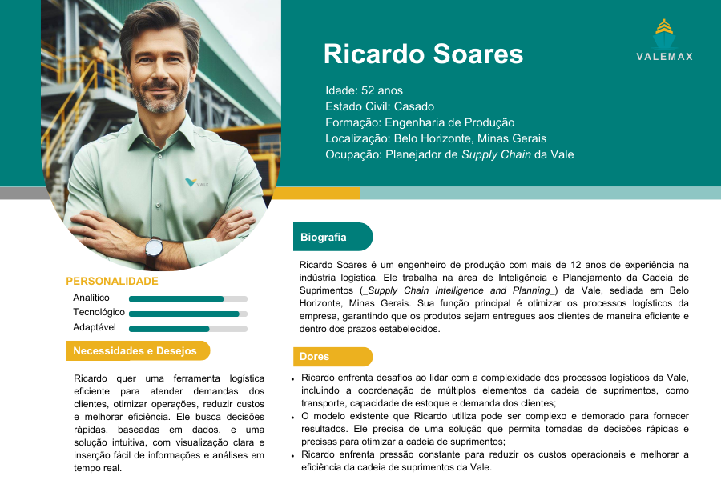
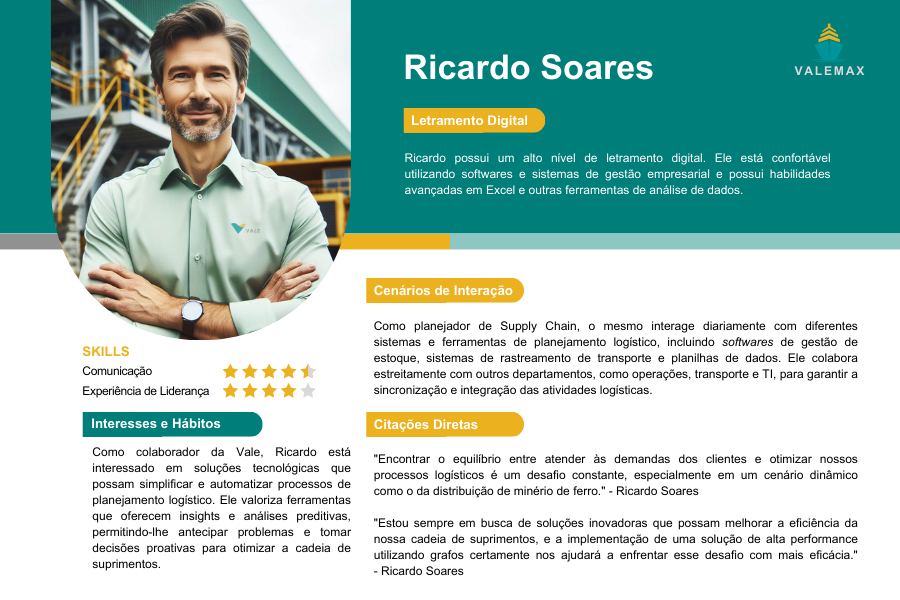

# Entendimento da experiência do usuário

# 1. Persona - Planejador de _Supply Chain_ da Vale

&emsp;&emsp;No contexto de projetos e estratégias empresariais, uma persona é uma representação fictícia de um usuário ideal, baseada em dados reais sobre comportamentos e necessidades dos clientes ou usuários reais. No projeto de aumento da performance logística na distribuição de minério de ferro da Vale, definir uma persona é crucial para compreender as necessidades, desafios e preferências dos usuários finais da solução proposta. A Seguir, apresenta-se a persona escolhida para representar o principal usuário da solução proposta pela equipe ValeMax. [1]

 

   <b>Figura 1 -</b> 1° Mapa de Persona: Ricardo Soares

   

      </a>
   

   Fonte: Elaboração ValeMax (2024)

 

 

   <b>Figura 2 -</b> 2° Mapa de Persona: Ricardo Soares

   

      </a>
   

   Fonte: Elaboração ValeMax (2024)

 

## 1.1 Informações Demográficas:

* Gênero: Masculino
* Localização: Belo Horizonte, Minas Gerais
* Estado Civil: Casado
* Dependentes: Dois filhos pequenos (4 e 6 anos)
* Formação: Graduado em Engenharia de Produção
* Ocupação: Planejador de _Supply Chain_ da Vale

## 1.2 Biografia

&emsp;&emsp;Ricardo Soares é um engenheiro de produção com mais de 12 anos de experiência na indústria logística. Ele trabalha na área de Inteligência e Planejamento da Cadeia de Suprimentos (_Supply Chain Intelligence and Planning_) da Vale, sediada em Belo Horizonte, Minas Gerais. Sua função principal é otimizar os processos logísticos da empresa, garantindo que os produtos sejam entregues aos clientes de maneira eficiente e dentro dos prazos estabelecidos. 

### 1.2.1. Importância da Persona

&emsp;&emsp;No caso específico do Ricardo Soares no cargo de Planejador de _Supply Chain_, ele é escolhido como uma persona exemplar por ser um profissional experiente na indústria logística, com conhecimento abrangente sobre os processos e desafios enfrentados na gestão da cadeia de suprimentos da Vale. Como parte integrante da equipe responsável por otimizar os fluxos de minério, Ricardo representa um dos principais _stakeholders_ cujas necessidades e perspectivas devem ser consideradas durante o desenvolvimento e implementação da solução de aumento de performance logística. Sua experiência e conhecimento fazem dele um exemplo valioso para ilustrar as demandas e expectativas dos planejadores de _Supply Chain_ da empresa, visto que, ele será o principal usuário da solução proposta pela ValeMax. [2]
 
### 1.3 Dores, Necessidades e Desejos:

#### 1.3.1. Dores:

1. **Complexidade no Planejamento Logístico:**
   - Ricardo enfrenta desafios ao lidar com a complexidade dos processos logísticos da Vale, incluindo a coordenação de múltiplos elementos da cadeia de suprimentos, como transporte, capacidade de estoque e demanda dos clientes.

2. **Dificuldade em Tomar Decisões Rápidas:**
   - O modelo existente que Ricardo utiliza pode ser complexo e demorado para fornecer resultados. Ele precisa de uma solução que permita tomadas de decisões rápidas e precisas para otimizar a cadeia de suprimentos.

3. **Pressão para Reduzir Custos Operacionais:**
   - Ricardo enfrenta pressão constante para reduzir os custos operacionais e melhorar a eficiência da cadeia de suprimentos da Vale.

#### 1.3.2. Necessidades:

1. **Ferramenta de Planejamento Eficiente:**
   - Ricardo necessita de uma ferramenta de planejamento logístico que seja eficiente e capaz de lidar com a complexidade das operações da Vale, fornecendo resultados precisos em tempo hábil.

2. **Tomada de Decisão Ágil:**
   - Ele precisa de uma solução que permita a tomada de decisões ágeis e baseadas em dados para garantir o atendimento das demandas dos clientes e a maximização da eficiência operacional.

3. **Redução de Custos e Melhoria da Eficiência:**
   - Uma solução que ajude a reduzir os custos operacionais e melhorar a eficiência em toda a cadeia de suprimentos é essencial para Ricardo e para a Vale.

#### 1.3.3. Desejos:

1. **Sistema de Resposta Rápida:**
   - Ricardo deseja uma solução que forneça resultados em tempo real ou com uma rapidez significativamente maior do que o modelo existente que leva 90 minutos para rodar.

2. **Facilidade de Uso:**
   - Ele deseja uma ferramenta de planejamento logístico que seja intuitiva e fácil de usar, permitindo inserção simplificada de dados e visualização clara das informações relevantes.

3. **Visualização e Interatividade Aprimoradas:**
   - Ricardo gostaria de ter uma solução que ofereça recursos de visualização e interatividade aprimorados, possibilitando uma compreensão mais fácil dos dados e análises realizadas.

## 1.4 Cenários de Interação

&emsp;&emsp;Como planejador de _Supply Chain_, o mesmo interage diariamente com diferentes sistemas e ferramentas de planejamento logístico, incluindo _softwares_ de gestão de estoque, sistemas de rastreamento de transporte e planilhas de dados. Ele colabora estreitamente com outros departamentos, como operações, transporte e TI, para garantir a sincronização e integração das atividades logísticas. 

## 1.5 Interesses e Hábitos Relacionados ao Sistema ou Produto

&emsp;&emsp;Como colaborador da Vale, Ricardo está interessado em soluções tecnológicas que possam simplificar e automatizar processos de planejamento logístico. Ele valoriza ferramentas que oferecem _insights_ e análises preditivas, permitindo-lhe antecipar problemas e tomar decisões proativas para otimizar a cadeia de suprimentos.

## 1.6 Nível de Letramento Digital

&emsp;&emsp;Ricardo possui um alto nível de letramento digital. Ele está confortável utilizando _softwares_ e sistemas de gestão empresarial e possui habilidades avançadas em Excel e outras ferramentas de análise de dados.

## 1.7 Citações Diretas

&emsp;&emsp;"Encontrar o equilíbrio entre atender às demandas dos clientes e otimizar nossos processos logísticos é um desafio constante, especialmente em um cenário dinâmico como o da distribuição de minério de ferro." - Ricardo Soares

&emsp;&emsp;"Estou sempre em busca de soluções inovadoras que possam melhorar a eficiência da nossa cadeia de suprimentos, e a implementação de uma solução de alta performance utilizando grafos certamente nos ajudará a enfrentar esse desafio com mais eficácia." - Ricardo Soares

## 2. User Stories

&emsp;&emsp;No desenvolvimento utilizando metodologias ágeis, as *User Stories* são uma ferramenta essencial para compreender as reais necessidades dos usuários finais, tendo em vista que são criadas sob ponto de vista dos mesmos. O uso dessa metodologia é de suma importância porque proporciona maior clareza para os membros da equipe de desenvolvimento, sobre qual caminho devem seguir para sanar exatamente quais dores que afetam os usuários finais da solução. Tais histórias devem responder três perguntas principais, sendo quem é o sujeito que passa por ela, o que ele precisa e o motivo de precisar. Obter a resposta desses três pontos sob a perspectiva de quem passa pela história garante que a metodologia do *design thinking* seja aplicada no projeto, ou seja, que a solução seja construída com foco total em quem vai utilizá-la, assim garantindo sua eficiência e qualidade.

&emsp;&emsp;Nesse contexto, o uso dessa metodologia foi de suma importância para a estruturação dos principais requisitos que devem ser atendidos para a persona que utilizará a solução. Para isso, foram escolhidos problemas específicos do cliente que serão resolvidos pelo algoritmo de otimização, sendo elas focadas em aprimorar o rastreamento do transporte de minérios, das mineradoras até aos portos, melhorando a eficiência operacional. Além disso, também foram considerados requisitos ligados à interface web, meio pelo qual será possível visualizar, analisar e filtrar informações de modo eficiente, um ponto de fundamental para que além de resolver o problema, a solução também seja de fácil uso. Seguem as *User Stories* construídas para a persona Ricardo Soares, contendo sua identificação, nível de importância e efetivamente seu conteúdo.

 

   <b>Tabela 01 -</b> User Story 

| User Story | Importância | Persona       | História |
|------------|-------------|---------------|----------|
| US1        | Alta        | Ricardo Soares | Eu, como planejador de _supply chain_ da Vale, preciso verificar quais são os minérios em trajeto no momento atual. |
| US2        | Alta        | Ricardo Soares |Como planejador de transporte de minérios da Vale, desejo verificar detalhes específicos de cada lote. Incluindo informaçôes, como: tipo de minério, características do lote, rota percorrida e destino final, para assegurar a eficiência da entrega. |
| US3        | Alta        | Ricardo Soares | Como planejador de _supply chain_ desejo consultar o fluxo de minérios ao longo do ano, para identificar possíveis pontos de melhoria. |
| US4        | Baixa       | Ricardo Soares | Como funcionário da Vale, desejo ter acesso a um relatório mensal de desempenho do transporte, para que eu possa apresentar um resumo das atividades para meus superiores. |

   Fonte: Elaboração ValeMax (2024)

 

&emsp;&emsp;A partir das *User Stories* criadas é possível estruturar o desenvolvimento de uma solução totalmente relacionada e focada nas demandas do cliente e das principais funcionalidades do *software* que solucionarão o que foi pedido. A implementação dessa ferramenta no desenvolvimento do projeto em conjunto com a aplicação de outras metodologias, técnicas de *UX*, além da colaboração entre os desenvolvedores, *stakeholders* e *designers*, garantem com que o *MVP* final se torne mais robusto, eficiente e relevante para resolver o problema do usuário.

# 3. Referências

[1] Medium. Persona: Por Que É Essencial para Qualquer Projeto em UX Design?. Disponível em: [Medium](https://medium.com/aela/persona-por-que-%C3%A9-essencial-para-qualquer-projeto-em-ux-design-b91747c03015). Acesso em: 07 de Fev. 2024.  

[2] Vale. Relacionamento com Fornecedores. Disponível em: [Vale](https://vale.com/pt/esg/fornecedores). Acesso em: 08 de Fev. 2024.  
