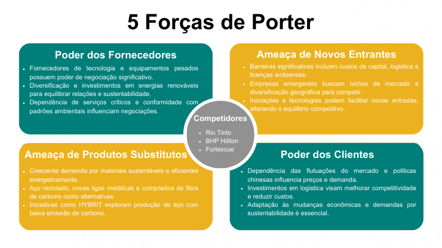
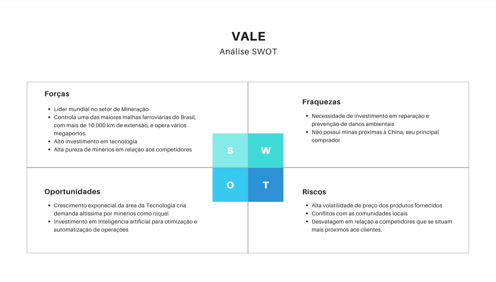
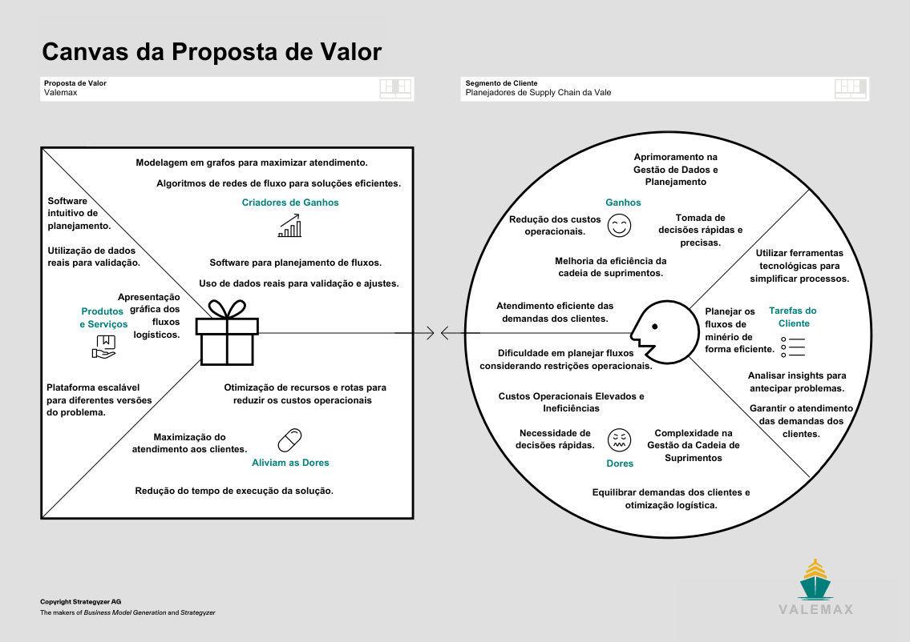
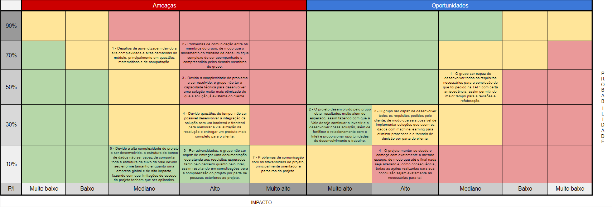

# Entendimento de negócio

## 1. Contextualização da Industria do Parceiro + 5 Forças de Porter

&emsp;&emsp;O mercado global de minérios é um dos setores mais competitivos e estratégicos, fundamental para a economia mundial, dada a sua importância na cadeia de produção de diversos bens e serviços, desde a construção civil até a tecnologia de ponta. A Vale, originária do Brasil, destaca-se como uma das maiores produtoras e exportadoras de minério de ferro e pelotas do mundo, desempenhando um papel crucial nesse mercado. Com operações abrangentes que incluem também a produção de níquel, cobre, manganês, entre outros, a Vale não só contribui significativamente para o mercado global de minérios com seu amplo portfólio de produtos mas também com suas iniciativas de sustentabilidade e inovação tecnológica. A empresa possui uma participação expressiva no mercado, com suas atividades se estendendo por diversos continentes, o que a coloca em posição de destaque frente a seus competidores.

&emsp;&emsp;Os principais concorrentes da Vale no mercado global de minérios incluem gigantes da mineração como a Rio Tinto, a BHP Billiton e a Fortescue Metals Group. A Rio Tinto, com operações significativas como a mina de Simandou na África e várias minas próximas à China, beneficia-se de frete reduzido devido à proximidade com o principal mercado consumidor de minério de ferro, a China. Isso oferece à Rio Tinto uma vantagem competitiva em termos de custos logísticos. A BHP Billiton, outra gigante da mineração, compete diretamente com a Vale em diversos segmentos, incluindo o de minério de ferro, cobre e níquel, operando em uma escala global com uma diversificada carteira de ativos minerais. A Fortescue Metals Group, focada principalmente na exploração de minério de ferro na Austrália, também se destaca por sua eficiência operacional e estratégias de mercado voltadas para a Ásia, especialmente a China.

&emsp;&emsp;As tendências de mercado atuais indicam uma crescente demanda por minerais utilizados na transição energética, como o cobre e o níquel, essenciais na fabricação de baterias para veículos elétricos e outras tecnologias verdes. Nesse contexto, a Vale e seus competidores estão investindo em tecnologias de extração e processamento mais sustentáveis, buscando não apenas atender à demanda crescente por esses minerais mas também alinhar suas operações com as exigências globais por práticas de mineração mais responsáveis ambientalmente. A competição no mercado de minérios, portanto, transcende a simples produção e venda de commodities, envolvendo também a capacidade das empresas de inovar e de se adaptar às novas demandas sociais e ambientais, configurando um cenário de intensa disputa por liderança em sustentabilidade e eficiência operacional.

### 1.1 5 Forças de Porter

&emsp;&emsp;As Cinco Forças de Porter, um modelo estruturado por Michael E. Porter em 1979, são uma ferramenta fundamental para a análise da competição empresarial e do ambiente externo de uma organização. Este modelo destina-se a avaliar o grau de competição e a atratividade de um mercado, através da análise de cinco aspectos cruciais: a rivalidade entre os concorrentes existentes, a ameaça de novos entrantes no mercado, a ameaça de produtos ou serviços substitutos, o poder de negociação dos clientes e o poder de negociação dos fornecedores. A compreensão dessas forças permite às empresas desenvolver estratégias mais eficazes para enfrentar a competição, identificar oportunidades e ameaças no ambiente de mercado e aprimorar sua posição competitiva.

&emsp;&emsp;O infográfico a seguir apresenta uma síntese das Cinco Forças de Porter aplicadas ao contexto específico da indústria de mineração, com foco na análise do mercado global de minérios e na posição da Vale, uma das maiores produtoras e exportadoras de minério de ferro e pelotas do mundo. Através de uma visão concisa, o infográfico aborda as complexidades desse ambiente competitivo em pontos chave, proporcionando uma visão clara das dinâmicas de mercado que moldam as estratégias e operações da Vale e de seus principais concorrentes.

 

   <b>Figura 1 -</b> 5 Forças de Porter

   

      </a>
   

   Fonte: Elaboração ValeMax (2024)

 

1. **Rivalidade entre os concorrentes:**

&emsp;&emsp;Analisando a rivalidade entre os concorrentes no mercado de minério de ferro sob a perspectiva das Cinco Forças de Porter, observa-se que a competição é intensa e é majoritariamente definida por gigantes globais que competem com a Vale, como Rio Tinto, BHP Billiton e Fortescue Metals Group. Cada um desses competidores possui vantagens estratégicas que influenciam diretamente sua posição no mercado. A Rio Tinto, por exemplo, com sua mina de Simandou [1] e outras operações próximas à China, beneficia-se de custos logísticos reduzidos devido à proximidade com o maior consumidor mundial de minério de ferro, oferecendo uma vantagem competitiva em termos de eficiência no transporte e na capacidade de resposta às demandas do mercado asiático [2]. Por outro lado, a BHP Billiton e a Fortescue Metals Group também mantêm uma forte presença no mercado chinês, com grandes exportações para a região, aproveitando suas operações otimizadas e estratégias de mercado focadas para maximizar o retorno frente à demanda constante.

&emsp;&emsp;A rivalidade se acirra à medida que essas empresas buscam não apenas aumentar sua participação no mercado global, mas também inovar em suas operações para reduzir custos e impacto ambiental, em linha com as crescentes exigências por práticas de mineração sustentáveis. A Fortescue, por exemplo, destaca-se em seus relatórios financeiros, como o do último trimestre reportado, pela sua capacidade de manter operações eficientes e um forte compromisso com a sustentabilidade [3], o que reflete uma tendência geral do setor em direção à inovação e à eficiência energética.

&emsp;&emsp;Essa competição não se limita apenas à produção e venda de minério de ferro, mas se estende às áreas de pesquisa e desenvolvimento, sustentabilidade e estratégias de mercado, onde a capacidade de adaptar-se rapidamente às mudanças de demanda e aos padrões ambientais globais pode definir o sucesso ou o fracasso no longo prazo. Portanto, a rivalidade entre esses gigantes da mineração é um motor crucial para a inovação no setor, impulsionando melhorias contínuas em tecnologia, eficiência operacional e práticas sustentáveis.

&emsp;&emsp;Em 2020, a Vale produziu 300,4 milhões de toneladas de minério de ferro, o que representa uma participação de 20% no mercado global [4], sendo superior à Rio Tinto que produziu 286 milhões de toneladas de minério de ferro, com uma fatia de 19% do mercado mundial. A BHP Billiton produziu 248,3 milhões de toneladas, com uma participação de 16% e a Fortescue Metals Group produziu 178,2 milhões de toneladas, com uma fatia de 12%.

&emsp;&emsp;Em termos financeiros, as quatro empresas tiveram resultados expressivos em 2020, apesar da pandemia de Covid-19 e dos desafios ambientais e sociais. A Rio Tinto teve a maior receita, com US$ 44,6 bilhões, seguida pela BHP Billiton, com US$ 42,9 bilhões, e pela Vale, com US$ 40,5 bilhões. A Fortescue Metals Group teve a menor receita, com US$ 12,8 bilhões. Porém, a Fortescue Metals Group teve o maior lucro líquido proporcional à receita, com US$ 4,7 bilhões, o que representa uma margem de 36,7% [5] [6] [7].

2.  **Ameaça de novos entrantes:**

&emsp;&emsp;A entrada de novos competidores no mercado de minério de ferro é uma dinâmica complexa, significativamente influenciada por barreiras substanciais. Estas barreiras incluem o alto custo de capital necessário para o desenvolvimento de minas, a infraestrutura logística para o transporte do minério, a obtenção de licenças ambientais e operacionais, e o acesso a reservas de minério de alta qualidade. Estes fatores juntos criam um ambiente desafiador para novos entrantes, favorecendo empresas estabelecidas com operações em grande escala, como a Vale, Rio Tinto, BHP Billiton e Fortescue Metals Group, que já possuem a infraestrutura necessária e relações estabelecidas no mercado.

&emsp;&emsp;Empresas como a Champion Iron [8] e a African Industries [9], bem como a Sundance Resources [10], ilustram diferentes abordagens para superar essas barreiras. A Champion Iron, por exemplo, destaca-se pela sua operação na Mina de Bloom Lake no Canadá, focando em minério de ferro de alta qualidade. Essa estratégia permite que a empresa se posicione como um fornecedor de nicho, apelando para fabricantes de aço que buscam eficiência na produção de aço através de minérios de maior qualidade. Além disso, a diversificação geográfica de suas operações oferece uma alternativa aos riscos associados à concentração de operações em regiões específicas, como Austrália e Brasil. A Champion Iron's plans de expansão indicam uma ambição de se tornar um competidor mais significativo, potencialmente aumentando sua participação no mercado global, especialmente em mercados de exportação como a China.

&emsp;&emsp;Por outro lado, empresas emergentes na África, como a African Industries e a Sundance Resources, sede australiana mas atuação primária em Camarões, enfrentam seus próprios conjuntos de desafios e oportunidades. A África é rica em recursos minerais, incluindo depósitos significativos de minério de ferro, mas as operações nessas regiões muitas vezes lidam com questões adicionais, como instabilidade política, infraestrutura logística subdesenvolvida e preocupações ambientais e sociais. Essas empresas buscam superar essas barreiras por meio de investimentos em infraestrutura, parcerias estratégicas e conformidade rigorosa com regulamentações ambientais e sociais.

&emsp;&emsp;Assim, enquanto as altas barreiras de entrada limitam a ameaça de novos entrantes no mercado de minério de ferro, empresas inovadoras e geograficamente diversificadas como a Champion Iron apresentam exemplos de como novos jogadores podem se estabelecer e crescer neste setor. É crucial para grandes _players_ como a Vale monitorarem esses desenvolvimentos, pois a introdução de novas tecnologias e métodos de extração pode, eventualmente, facilitar a entrada de novos competidores, alterando o equilíbrio competitivo no mercado global de minério de ferro.

3.  **Ameaça de produtos substitutos:**

&emsp;&emsp;A ameaça de produtos substitutos no mercado de minério de ferro é uma força crescente que reflete as mudanças nas demandas por materiais mais sustentáveis e com menor impacto ambiental. À medida que governos, consumidores e indústrias intensificam seus esforços para reduzir as emissões de carbono e melhorar a eficiência energética, o desenvolvimento de alternativas ao minério de ferro ganha ímpeto. O aço reciclado emerge como uma opção viável, aproveitando a economia circular para reduzir a necessidade de novo minério de ferro e diminuir a pegada de carbono associada à sua extração e processamento. Empresas como a Nucor Corporation [11] e a ArcelorMittal [12] estão liderando o caminho nesse aspecto, investindo em tecnologias que melhoram a eficiência do aço reciclado.

&emsp;&emsp;Além do aço reciclado, novas ligas metálicas e materiais compósitos apresentam-se como substitutos inovadores que podem reduzir ou eliminar a necessidade de ferro puro em diversas aplicações. Por exemplo, a Hexcel e a Toray Industries [13] estão avançando no desenvolvimento e na aplicação de compósitos de fibra de carbono, que oferecem força e leveza superiores para a indústria aeroespacial e automotiva, substituindo metais pesados, incluindo o aço tradicional.

&emsp;&emsp;Outro desenvolvimento notável é o esforço colaborativo da joint venture HYBRIT [14], que envolve a SSAB, a LKAB (uma mineradora de ferro) e a Vattenfall (uma empresa de energia). Eles estão explorando a produção de aço livre de combustíveis fósseis utilizando tecnologia de redução direta de ferro (DRI) alimentada por hidrogênio, que promete revolucionar a indústria siderúrgica com um método de produção de aço com baixíssimas emissões de carbono. Essa iniciativa não só destaca o potencial para inovações disruptivas no setor siderúrgico mas também destaca a importância da Vale de monitorar e adaptar-se a essas tendências para empresas dependentes da demanda por minério de ferro.

4.  **Poder de negociação dos clientes:**

&emsp;&emsp;O poder de negociação dos clientes da Vale, especialmente considerando o dinâmico e volátil mercado internacional de minério de ferro, revela-se como um fator crítico na determinação de sua posição competitiva global. A interação entre a Vale e seus clientes chineses, em particular, exemplifica a complexidade dessa relação, uma vez que a China representa o maior consumidor individual de minério de ferro do mundo. A dependência logística e as flutuações nos custos de frete desempenham um papel significativo na capacidade da Vale de oferecer preços competitivos, enquanto mantém margens de lucro saudáveis. Os investimentos em infraestrutura logística, como os navios Valemax, visam mitigar essas vulnerabilidades, embora estejam sujeitos a uma série de desafios regulatórios e de mercado. Além disso, a demanda chinesa por minério de ferro é influenciada por fatores internos, como políticas de construção e produção de aço, bem como por esforços para diversificar fontes de importação e aumentar a utilização de aço reciclado, representando uma ameaça potencial à demanda futura pelos produtos da Vale.

&emsp;&emsp;No cenário doméstico brasileiro, a Vale encontra-se em uma posição mais confortável em termos de poder de negociação com seus clientes. A proximidade geográfica e a integração das cadeias de suprimento [15]conferem à empresa uma vantagem logística distinta, permitindo-lhe oferecer custos mais baixos e tempos de entrega reduzidos em comparação com competidores internacionais. Essa proximidade facilita a negociação de contratos de longo prazo e condições de pagamento favoráveis, reforçando a posição da Vale no mercado nacional. Contudo, a demanda interna por minério de ferro é limitada pelo tamanho do mercado de aço no Brasil, que é afetado por variáveis econômicas locais e pela demanda global por aço, requerendo que a Vale mantenha uma estratégia equilibrada entre maximizar o valor em seu mercado doméstico e expandir sua presença internacionalmente.

&emsp;&emsp;Em face dessas realidades, a Vale deve explorar o ambiente de mercado adaptando-se às mudanças nas condições econômicas, às demandas específicas dos clientes e às tendências de sustentabilidade global. Isso inclui uma atenção contínua às práticas de mineração sustentáveis e à inovação tecnológica, para não apenas atender às exigências ambientais crescentes, mas também para manter sua competitividade frente a concorrentes globais e a potenciais mudanças nas preferências dos consumidores. A habilidade da Vale de equilibrar esses aspectos determinará sua capacidade de sustentar e expandir sua posição de mercado frente às dinâmicas globais e às pressões competitivas, tanto no cenário internacional quanto no doméstico.

5.  **Poder de negociação dos fornecedores:**

&emsp;&emsp;Na complexa teia de relações da Vale com seus fornecedores, a empresa enfrenta uma dinâmica de poder de negociação multifacetada, que é influenciada por uma diversos fatores, desde a especialização tecnológica até questões geopolíticas e ambientais. Empresas renomadas no fornecimento de equipamentos pesados para mineração, como Caterpillar [16] e Komatsu [17], representam parceiros vitais cuja tecnologia avançada e especialização conferem-lhes um poder de negociação substancial. A dependência em tais fornecedores destaca a importância crítica da manutenção de relações comerciais equilibradas, onde a estratégia de diversificação de fornecedores e o volume significativo de compras da Vale emergem como alavancas fundamentais para negociar termos mais favoráveis, equilibrando a relação de poder.

&emsp;&emsp;Adicionalmente, a gestão de insumos operacionais críticos, como energia, combustíveis e explosivos, coloca a Vale em um espectro de negociação que varia conforme a região e a disponibilidade de alternativas. No Brasil, a interação com fornecedores dominantes nesses setores, exemplificada pela relação com a Petrobras, reflete a complexidade de negociar sob condições de oferta limitada. Contudo, a investida da Vale em energias renováveis e eficiência energética não apenas responde a essas limitações mas também alinha a empresa às crescentes demandas por sustentabilidade [18], reduzindo sua vulnerabilidade ao poder de negociação de fornecedores específicos e fortalecendo sua posição negociadora através da diversificação energética.

&emsp;&emsp;A parceria com a MRS Logística [19], responsável pela operação do sistema ferroviário sul com um contrato fixo de transporte exemplifica uma situação onde a Vale enfrenta um poder de negociação reduzido, dada a natureza do acordo contratual e a importância estratégica dessa logística para suas operações. Tal cenário sublinha a importância de estratégias de negociação e planejamento logístico detalhado para mitigar riscos associados à dependência de serviços críticos.

&emsp;&emsp;Globalmente, o poder de negociação dos fornecedores da Vale é ainda moldado por fatores geopolíticos, regulamentações ambientais e a crescente pressão por práticas sustentáveis. A capacidade da Vale de se adaptar a esses fatores, trabalhando em estreita colaboração com seus fornecedores para assegurar a conformidade com padrões ambientais e sociais elevados, não só influencia positivamente as negociações mas também reforça a reputação da empresa como líder em sustentabilidade no setor de mineração. Esta abordagem estratégica não apenas fortalece a posição negociadora da Vale com fornecedores globais mas também alinha a empresa com as expectativas de stakeholders e tendências de mercado, assegurando sua competitividade e liderança em um ambiente de negócios cada vez mais consciente do ponto de vista ambiental e social.

## 2. Análise SWOT

&emsp;&emsp;A Análise *SWOT*, como o nome destaca, é uma ferramenta que auxilia na análise dos pontos fortes, fracos, oportunidades e ameaças de um determinado negócio. Esse processo é realizado a partir de uma matriz com quatro quadrantes, sendo dois destinados ao ambiente interno da organização, enquanto os outros dois estão relacionados com o ambiente externo, ou seja, são eventos que não estão no controle do que foi analisado. As forças podem ser definidas como fatores internos de uma empresa ou negócio que a diferem dos concorrentes, enquanto as fraquezas são pontos que podem causar algum tipo de prejuízo ao desenvolvimento da organização. As oportunidades são eventos externos que podem impactar positivamente no desenvolvimento do negócio, enquanto as ameaças têm impacto negativo. Dado tal relação de elementos internos e externos da matriz *SWOT*, é notável que os pontos internos podem ser trabalhados e desenvolvidos pela própria organização para que suas forças sejam potencializadas, enquanto suas fraquezas mitigas. Em contrapartida, os elementos externos apenas podem ser identificados e prevenidos.

&emsp;&emsp;No contexto do projeto, a análise *SWOT* é uma ferramenta de suma importância para auxiliar na compreensão dos principais elementos internos e externos que compõem o cliente. O conhecimento das principais forças e fraquezas de uma empresa faz com que a solução seja desenvolvida com foco em potencializar as principais forças do cliente, além de sanar possíveis dores e fraquezas mediante novas abordagens, implementação de novas tecnologias e/ou melhoria de processos já existentes. Ademais, conhecer os fatores externos também garantem que novas oportunidades sejam aproveitadas para a construção de uma solução inovadora e que aproveite precisamente dos pontos benéficos para a organização, além de que o projeto pode ter um papel de prevenir possíveis ameaças via mudanças de processos. O conhecimento de cada um desses pontos pode potencializar o projeto desenvolvido, fazendo com que a solução adeque-se ao cenário da empresa em questão, garatindo assim sua coerência com os valores e problemas propostos pelo cliente.

 

   <b>Figura 2 -</b> Matriz de Riscos

   

      </a>
   

   Fonte: Elaboração ValeMax (2024)

 

**Forças:**

- **Líder mundial no setor de Mineração:** A Vale se destaca como uma das maiores empresas globais em mineração, liderando em volume de produção e vendas de minerais essenciais para a indústria mundial. 
- **Controle de uma das maiores malhas ferroviárias do Brasil:** Com mais de 10.000 km de extensão em sua malha ferroviária, a Vale garante uma logística eficiente e de grande capacidade, facilitando o transporte de grandes volumes de minério para os portos.
- **Alto investimento em tecnologia:** A empresa prioriza a inovação tecnológica, o que melhora a eficiência operacional, aumenta a segurança e reduz custos.
- **Alta pureza de minérios em relação aos competidores:** A qualidade superior dos minérios extraídos pela Vale proporciona uma vantagem competitiva, uma vez que pode resultar em produtos finais melhores e processos de produção mais eficientes para seus clientes.

Essas forças colocam a Vale em uma posição privilegiada no mercado, com uma capacidade de influenciar preços e padrões de mercado, além de ter a habilidade de investir em novas tecnologias e expandir suas operações globalmente. 

**Fraquezas:**

- **Necessidade de investimento em reparação e prevenção de danos ambientais:** Incidentes passados e o impacto ambiental contínuo da mineração requerem investimentos significativos em medidas de reparação e prevenção, o que pode ser custoso e afetar a imagem da empresa.
- **Não possui minas próximas à China:** A distância das minas da Vale até a China, que é um dos seus maiores mercados, pode representar um desafio logístico e aumentar os custos de transporte.

A necessidade de investimentos ambientais pode pressionar as finanças e a reputação da Vale, enquanto a localização geográfica de suas operações podem apresentar desafios operacionais e financeiros significativos.

**Oportunidades:**

- **Crescimento exponencial da área da Tecnologia:** A demanda por metais utilizados em tecnologias avançadas, como o níquel em baterias de veículos elétricos, está aumentando. Isso abre novos mercados para a Vale explorar.
- **Investimento em Inteligência Artificial:** O uso de IA para otimização e automação de operações pode levar a ganhos de eficiência significativos, reduzindo custos e aumentando a segurança.

A posição da Vale para aproveitar o crescimento tecnológico e a inovação em IA pode impulsionar sua eficiência operacional e abrir novos canais de receita, além de melhorar a sustentabilidade de suas operações.

**Riscos:**

- **Alta volatilidade de preço dos produtos fornecidos:** Os preços dos minérios são altamente voláteis e sujeitos a flutuações do mercado global, o que pode afetar a estabilidade financeira da Vale.
- **Conflitos com as comunidades locais:** As operações de mineração podem levar a disputas com comunidades locais, o que pode causar atrasos, aumentar custos e prejudicar a reputação da empresa.
- **Desvantagem em relação a competidores que se situam mais próximos aos clientes:** Outros competidores que têm operações mais próximas de mercados-chave, como a China, podem ter vantagens logísticas e de custo.

Esses riscos representam ameaças significativas às operações da Vale e à sua posição no mercado. A empresa deve gerenciar ativamente essas questões para manter sua competitividade e garantir operações sustentáveis a longo prazo.

&emsp;&emsp;Assim, o principal objetivo desta análise é possibilitar o entendimento de fatores internos e externos que podem ajudar ou atrapalhar no desenvolvimento do negócio. A partir disto, a empresa é capaz de situar-se, entendendo quais características podem ser usadas para a promoção da marca e quais ainda precisam ser trabalhadas. A partir da realização dessa análise, percebe-se que o projeto desenvolvido está diretamente relacionado com principais forças da Vale, sendo elas principalmente relacionadas ao alto investimento em tecnologia e sua extensa malha de produtos, infraestrutura, minerais e grande fluxo de transportes e entregas que vão desde suas usinas até seus clientes. Desse modo, um projeto de maximização de volume baseado em grafos tornará parte desse processo ainda mais otimizado, resultando em um aumento das forças da empresa e trazendo um grande impacto para o fluxo de seus produtos.

## 3. Descrição da solução a ser desenvolvida

&emsp;&emsp;A eficiência na cadeia de suprimentos é um fator crucial para o sucesso de muitas empresas, em especial para indústrias altamente demandantes como a de mineração. A Vale, líder global nesse setor, enfrenta desafios para garantir o fluxo máximo de seus minérios. No decorrer dos seguintes tópicos, serão respondidas as principais questões que englobam a solução a ser desenvolvida.

### 3.1. Qual é o problema a ser resolvido?

&emsp;&emsp;O principal desafio a ser resolvido é encontrar uma forma de maximizar o volume dos produtos entregues para os clientes da Vale, ou seja, partindo de seus principais pontos de produção como as usinas de beneficiamento, passando pelos pontos conhecidos como entrepostos e chegando até os clientes, quais os melhores caminhos que devem ser escolhidos pensando na entrega do máximo de volume possível dos produtos da Vale, sendo eles principalmente o minério de ferro e seus derivados.

### 3.2. Qual a solução proposta? (visão de negócios)

&emsp;&emsp;A proposta baseia-se na construção de uma solução baseada em grafos focada em maximizar o volume das entregas de produtos do cliente, além de proporcionar formas de visualização intuitivas para melhorar a capacidade de análise dos usuários focados no *supply chain* da Vale.

### 3.3. Como a solução proposta deverá ser utilizada?

&emsp;&emsp;A solução proposta deverá ser utilizada através de uma interface web que contará com o sistema de banco de dados baseado em grafos rodando no *backend*, além dos algoritmos em Java que garantirão a otimização do fluxo de produtos da Vale, visando o máximo de volume mediante as restrições estabelecidas pelo problema. Através desse *frontend*, o usuário será capaz de adicionar inputs dos dados que deseja otimizar dentro do algoritmo, assim obtendo os grafos que representam o fluxo dos produtos desejados.

### 3.4. Quais os benefícios trazidos pela solução proposta?

&emsp;&emsp;Os principais benefícios proporcionados pela solução proposta são: um algoritmo otimizado para resolver o problema do fluxo de volumes não maximizados, além de uma visualização simples e intuitiva através da interface web para facilitar a análise, não só da entrega do produto ao final do fluxo, mas de seu histórico, para que assim os usuários da solução tenham uma compreensão melhor sobre todo o processo seguido pelos produtos da Vale.

### 3.5. Qual será o critério de sucesso e qual medida será utilizada para avaliar?

&emsp;&emsp;O principal critério de sucesso que será utilizado para avaliar a solução será a quantidade de volume (em toneladas) que será entregue para os clientes finais da Vale e se o caminho percorrido pelo algoritmo na solução representada em grafo realmente maximizou adequadamente a entrega, considerando todas as variáveis presentes no problema. Ademais, outra medida interessante para avaliar o sucesso da solução é seu tempo de execução, tendo em vista que uma das principais dores sofridas pelo cliente é o longo tempo de execução do algoritmo atualmente implementado, logo uma solução mais rápida e eficiente é vital para a empresa.

&emsp;&emsp;Ademais, é de suma importância definir algum _benchmark_ para auxiliar na análise dos resultados oferecidos pela ferramenta em desenvolvimento. Com isso, utilizando os dados disponíveis do cliente, foi executado um algoritmo de maximização de fluxo baseado no algoritmo _Edmonds-Karp_, resultando em um fluxo máximo de 195.138 unidades, sem otimização de estoque ou modificações significativas no algoritmo. Tal resultado preliminar pode ser considerado um _benchmark_ inicial.  

&emsp;&emsp;Além desse resultado inicial, é de suma importância realizar uma análise aprofundada do resultado que a Vale obtém da ferramenta que utilizam atualmente, assim garantindo um objeto de comparação ainda mais pautado na realidade e nas necessidades do cliente. O resultado obtido da ferramenta já implementada é um conjunto de seis planilhas com diversos dados para diferentes aspectos otimizados, tais dados estão relacionados com: evolução dos estoques ao longo do tempo, planos de atendimento, qualidade dos materiais, sazonalidades e utilização das capacidades de cada trecho entre os nós modelados no grafo. É evidente que, por tratar-se de um _MVP_, a solução em desenvolvimento ainda não proporciona uma gama tão diversa de otimizações e resultados tão complexos quanto a atual, sendo assim, os melhores dados para serem utilizados como de _benchmark_ são da utilização das capacidades de cada trecho, já que esse é um conjunto de dados totalmente correlacionado com a otimização de fluxo máximo por cada aresta do grafo. A otimização nesse conjunto de dados ocorre por todo o mês de abril de 2022, ou seja, para cada dia do mês há a previsão do que passará por cada trecho, processo esse que a solução em desenvolvimento ainda não realiza já que sua análise é em um contexto geral da aplicação. Entretanto, ao se analisar o contexto geral das otimizações da ferramenta atualmente implementada pelo parceiro, tem-se uma otimização em abril de 170.429 unidades, o que difere da otimização realizada pela ferramenta em desenvolvimento em apenas 24.709 unidades ou 12,6% de diferença, demonstrando que para a análise inicial da solução, sua distância em relação a uma otimização real e atualmente realizada não é tão grande, indicando solidez na solução ainda em estágio inicial.  

&emsp;&emsp;Em síntese, a solução proposta visa abordar os desafios enfrentados pela Vale em sua cadeia de suprimentos, fornecendo uma ferramenta baseada em grafos que busca maximizar o volume de produtos entregues aos clientes finais. Ao fornecer uma interface intuitiva e algoritmos otimizados, espera-se não apenas aumentar a eficiência operacional, mas também oferecer uma compreensão aprimorada do fluxo de produtos ao longo da cadeia de suprimentos. A análise preliminar demonstra uma sólida promessa para a solução em desenvolvimento, com resultados comparáveis aos obtidos com a ferramenta atualmente em uso pela Vale. Ao prosseguir com o desenvolvimento e refinamento da solução, espera-se alcançar um aumento significativo na eficiência e na satisfação do cliente, contribuindo assim para o sucesso contínuo da Vale em sua indústria altamente competitiva.

## 4. _Value Proposition Canvas_ do produto

 

   <b>Figura 3 -</b> Value Proposition Canvas

   

      </a>
   

   Fonte: Elaboração ValeMax (2024)

 

&emsp;&emsp;O _Value Proposition Canvas_, ou Canvas de Proposta de Valor, é uma ferramenta estruturada e visual fundamental para compreender e projetar produtos ou serviços que atendam efetivamente às necessidades e desejos dos clientes. Ele oferece uma análise detalhada dos componentes que formam a proposta de valor de um produto ou serviço, auxiliando as equipes na adequação de suas ofertas às expectativas dos clientes. [20]

&emsp;&emsp;No âmbito do projeto "Aumento da performance logística na distribuição de minério de ferro", o Canvas de Proposta de Valor desempenha um papel crucial na definição e desenvolvimento da solução. A Vale, como líder global na produção de minério de ferro, enfrenta desafios logísticos consideráveis na distribuição de seus produtos para clientes em todo o mundo.

&emsp;&emsp;Por meio do _Value Proposition Canvas_, a Valemax foi capaz de analisar as dores, ganhos e tarefas dos clientes da Vale no contexto específico da distribuição de minério de ferro. Isso envolve compreender as necessidades dos clientes, as restrições operacionais e as expectativas em relação ao serviço de distribuição. Abaixo, são destacados os principais elementos do Canvas de Proposta de Valor, concentrando-se na solução proposta para a Vale. 

### 4.1. Ganhos:
1. **Melhoria da Eficiência da Cadeia de Suprimentos:**
   - Otimização dos fluxos de minério de ferro, considerando diferentes modais de transporte.
   - Redução dos tempos de espera e dos custos associados à logística.
   - Aumento da capacidade de entrega dentro dos prazos estabelecidos.

2. **Aprimoramento na Gestão de Dados e Planejamento:**
   - Coleta e integração de dados para suportar o planejamento e monitoramento logístico.
   - Facilitação na tomada de decisões estratégicas através da visualização e análise de dados precisos.
   - Redução do tempo necessário para testar cada novo cenário no planejamento.

3. **Atendimento eficiente das demandas dos clientes:**
   - Aumento da confiabilidade e pontualidade das entregas.
   - Customização e adaptação das soluções logísticas de acordo com as necessidades específicas de cada cliente.

### 4.2. Dores:
1. **Complexidade na Gestão da Cadeia de Suprimentos:**
   - Dificuldades em lidar com múltiplos modais de transporte, pontos de transferência e restrições operacionais.
   - Desafios na coordenação de atividades entre diferentes áreas e parceiros logísticos.

2. **Gestão de Dados e Planejamento Deficiente:**
   - Falhas na obtenção e integração de dados precisos para o planejamento logístico.
  
3. **Custos Operacionais Elevados e Ineficiências:**
   - Desperdício de recursos devido a operações logísticas ineficientes.
   - Altos custos associados à manutenção de estoques desnecessários e transporte não otimizado.

### 4.3. Tarefas do Cliente:
1. **Planejamento dos fluxos  de minério de forma eficiente:**
   - Dimensionamento de capacidades de transporte e armazenamento.
   - Coordenação de atividades entre diferentes pontos da cadeia logística.

2. **Gestão e Análise de Dados:**
   - Coleta, integração e análise de dados para embasar decisões estratégicas.
   - Monitoramento contínuo do desempenho logístico e identificação de oportunidades de melhoria.

### 4.4. Criadores de Ganhos:
1. **Maximização da Eficiência Operacional:**
   - Implementação de algoritmos avançados de otimização para maximizar a capacidade de transporte e reduzir os tempos de espera e ociosidade dos recursos logísticos.
   - Utilização de modelagem em grafos e técnicas de programação linear para encontrar soluções eficientes e escaláveis.
   - Uso de dados reais para validação e ajustes.

2. **Aprimoramento da Experiência do Cliente:**
   - Melhoria da pontualidade e confiabilidade das entregas, aumentando a satisfação do cliente.
   - Customização e adaptação das soluções logísticas de acordo com as necessidades específicas de cada cliente, proporcionando um serviço mais personalizado e eficaz.

3. **Redução de Custos e Aumento da Rentabilidade:**
   - Identificação de oportunidades para redução de custos operacionais, como otimização de rotas, redução de estoques e minimização de desperdícios.
   - Aumento da eficiência e produtividade global da cadeia de suprimentos, resultando em uma melhor utilização dos recursos e uma maior rentabilidade para a empresa.

### 4.5. Produtos e Serviços:
1. **Plataforma de Gestão Logística Integrada:**
   - Ferramentas de visualização e análise de dados para suportar o planejamento e monitoramento logístico.

2. **Automação de Processos e Tomada de Decisão:**
   - Algoritmos avançados para otimização de rotas, capacidades de transporte e alocação de recursos.

### 4.6. Alívios de Dores:

1. **Redução de Custos e Aumento da Eficiência:**
   - Identificação e mitigação proativa de gargalos e ineficiências na cadeia de suprimentos.
   - Redução do tempo de execução da solução.
   - Maximização do atendimentos aos clientes.

&emsp;&emsp;Desse modo, o Canvas de Proposta de Valor pode ser utilizado para mapear as necessidades dos clientes em relação à distribuição de minério de ferro e para alinhar as soluções propostas com essas necessidades. Isso permitirá que a Valemax desenvolva uma solução que maximize o atendimento aos clientes da Vale, considerando as restrições operacionais e as metas do projeto.

## 5. Matriz de Riscos

&emsp;&emsp;A matriz de risco é uma ferramenta utilizada para avaliar a probabilidade de um evento acontecer, além de medir seus possíveis impactos, ou seja, de que forma ele afetaria o ambiente de trabalho. Somado aos possíveis desafios do projeto, a matriz também contempla oportunidades que podem vir a se desenvolver e que podem ser aproveitadas mediante identificações e ações prévias.

&emsp;&emsp;Essa ferramenta de negócios é de suma importância como uma forma de proporcionar a reflexão e compreensão sobre quais os riscos e oportunidades que podem se desenrolar durante todo o processo de desenvolvimento da solução. A matriz engloba tanto questões diretamente ligadas ao *MVP*, quanto fatores de impacto no processo de construção do produto, como problemas interno de organização, questões de comunicação, imprevistos externos ao projeto e outras situações que podem gerar impacto negativo (no caso das ameaças) ou positivos (no caso das oportunidades). É válido ressaltar que, para cada ameaça identificada, um plano de ação foi traçado para garantir que essa dificuldade possa ser superada com facilidade, bem como planos de ação para fazer bom uso das oportunidades.

 

   <b>Figura 4 -</b> Matriz de Riscos

   

      </a>
   

   Fonte: Elaboração ValeMax (2024)

 

&emsp;&emsp;Como apresentado na figura, uma série de riscos e oportunidades foram traçados de acordo com seu nível de impacto e probabilidade de acontecerem. Cada posicionamento foi feito conforme o quão complexo seria de reverter a situação das ameaças, e o quão benéfica cada oportunidade poderia ser para o projeto e para os membros do grupo. De mesmo modo, foi realizada uma avaliação da probabilidade de cada uma dessas situações ocorrerem com base em fatores de experiência, compreensão do problema, conversas com o parceiro e com os principais *stakeholders* do projeto. Em seguida, foram desenvolvidas estratégias para lidar com cada ameaça e oportunidade. Para auxiliar na compreensão, as ameaças foram numeradas de 1 até 7, e as oportunidades de 1 até 4. Essas numerações podem ser identificadas antes do enunciado de cada ameaça/oportunidade.

**Estratégias para cada ameaça:**

**01 -** O módulo 5 de ciência da computação realmente destaca-se pela sua dificuldade, precisamente por isso, uma proposta de contingência para esse risco é que todos os membros do grupo realizem com compromisso e seriedade os autoestudos do módulo, além de manterem a participação ativa nos encontros e o engajamento no projeto, assim garantindo que tanto o aprendizado teórico quanto o prático sejam bem consolidados por todos, assim aumentando a eficiência para a própria conclusão do projeto.

**02 -** Uma medida eficiente para lidar com problemas de comunicação é precisamente ter boas práticas na realização dos rituais do scrum, tais quais dailies, fechamento, plannings, retros, etc. Cada um desses momentos proporciona uma chance de comunicação e atualização para todos os membros do grupo, assim garantindo que todos saibam do andamento do trabalho de cada um. Além disso, maiores problemas de comunicação devem ser imediatamente informados ao orientador para garantir sua rápida resolução.

**03 -** Devido à complexidade do módulo e do problema apresentado, é possível que nesse primeiro momento, de fato, não seja possível a realização de todo o escopo pedido pelo parceiro, sobretudo em questões técnicas. Uma forma de lidar com isso, caso aconteça, é a constante conversa com o parceiro e atualização do que está sendo desenvolvido de modo que o cliente saiba exatamente quais os desafios que estão sendo enfrentados e compreenda possíveis mudanças de escopo e ajustes do projeto para a garantia de uma entrega sólida ao final. Em conjunto com isso, além da comunicação com o parceiro, também deve-se manter a constante comunicação com professores e com o orientador do projeto, tanto para obter maior suporte técnico para ser possível realizar o escopo macro, mas também para compreender quais pontos podem ser ajustados e adequados em caso de diminuição do que será feito.

**04 -** Considerando que o *frontend* e *backend* são etapas essenciais do projeto para exibição e efetivo uso do projeto, é de suma importância que para garantir sua conclusão, o planejamento de sua arquitetura e integrações sejam pensados com antecedência, preferencialmente desde a sprint inicial, para que toda a solução possa ser feita em conjunto, com isso garantindo a conclusão dessa etapa fundamental.

**05 -** Precisamente por estarmos usando um banco de dados baseado em grafos, é esperado que ele tenha uma capacidade maior de processamento dos dados e armazenamento, sendo esse um risco de baixa probabilidade. Entretanto, caso desafios sejam enfrentados pela base de dados ser demasiadamente grande, é esperado que uma seleção de *features* possa ser feita de modo a diminuir sua dimensionalidade, já que nem tudo se adequará ao projeto específico que está sendo desenvolvido. Outra solução eficiente é a criação de uma amostra dos dados, assim garantindo que tudo possa ser integralmente processado e armazenado.

**06 -** A documentação é outra etapa do projeto de suma importância que deve ser feita com critério e antecedência, isso tanto para os artefatos, quanto para artigo científico e o readme do projeto, sendo assim, é de suma importância que todas essas etapas sejam feitas em seu tempo e segundo os critérios estabelecidos pelo orientador e equipe de professores, assim garantindo sua conclusão.

**07 -** Para garantir que a comunicação com os *stakeholders* do projeto seja feita de maneira eficiente, é necessário que os membros do grupo se mantenham ativos através dos meios de comunicação principais (Slack e comunicação na sala de aula) além de seguir os rituais definidos pela metodologia ágil, assim garantindo a devida participação e boa comunicação com os principais meios para a resolução do projeto.

**Estratégias para cada oportunidade:**

**01 -** Caso o grupo finalize os principais requisitos solicitados pela TAPI com antecedência, é válido que tanto a solução como a documentação passem por devidas revisões para garantir que tudo tenha realmente sido concluído. Ademais, um plano para essa etapa é conversar com os *stakeholders* do projeto sobre possíveis melhorias que poderiam ser feitas tendo esse adiantamento em vista.

**02 -** Caso o projeto desenvolvido pelo grupo tenha resultados além do esperado, indicando que ele foi concluído com sucesso e atendendo as demandas esperadas, o contato com o cliente pode ser mantido, assim garantindo que a implementação da solução seja bem sucedida, além de que possíveis desenvolvimentos posteriores ao projeto possam ser feitos.

**03 -** Em caso do projeto ser bem-sucedido ao ponto da implementação de uma solução com machine learning, é importante ressaltar a comunicação com os professores e orientador do projeto devido à grande implementação e adição no escopo, além de ponderar muito bem quais dados poderiam ser utilizados para essa feature com ML e o quanto que isso agregaria valor para o projeto e para o parceiro.

**04 -** Esse caso seria de extrema raridade já que a tendência do projeto é sempre ser iterado e passar por mudanças que causem sua evolução e adequação para o que realmente é necessitado pelo parceiro. Entretanto, caso aconteça, uma medida é manter as ações restritas ao que foi pedido na TAPI e conversado inicialmente, além de buscar por melhorias que o próprio grupo vê como potencial para aplicar no projeto.

## 6. Referências
[1] Brazil Journal. "Rio Tinto dá a largada em Simandou, o maior projeto de mineração do mundo". Disponível em: [Brazil Journal](https://braziljournal.com/rio-tinto-da-a-largada-em-simandou-o-maior-projeto-de-mineracao-do-mundo/). Acesso em: 07 Fev. 2024.

[2] Bloomberg Linea. "CEO da Rio Tinto, concorrente da Vale, vê demanda chinesa por aço próxima do pico". Disponível em: [Bloomberg Linea](https://www.bloomberglinea.com.br/negocios/ceo-da-rio-tinto-concorrente-da-vale-ve-demanda-chinesa-por-aco-proxima-do-pico/). Acesso em: 07 Fev. 2024.

[3] Fortescue Metals Group. "FMG Quarterly Report Transcript". Disponível em: [Fortescue](https://cdn.fortescue.com/docs/default-source/announcements-and-reports/fmg_qtr_250124_transcript-fortescue.pdf?sfvrsn=42881688_8). Acesso em: 07 Fev. 2024.

[4] Vale. "Investidores". Disponível em: [Vale Investidores](https://vale.com/pt/investidores). Acesso em: 09 Fev. 2024.

[5] Forbes. "Is Rio Tinto Set To Increase Its Global Iron Ore Market Share As Vale Falters?". Disponível em: [Forbes Rio Tinto](https://www.forbes.com/sites/greatspeculations/2019/08/13/is-rio-tinto-set-to-increase-its-global-iron-ore-market-share-as-vale-falters/?sh=47ea96e3238a). Acesso em: 09 Fev. 2024.

[6] Statista. "BHP Billiton - Statistics & Facts". Disponível em: [Statista BHP Billiton](https://www.statista.com/topics/3401/bhp-billiton/#dossier-chapter4). Acesso em: 09 Fev. 2024.

[7] Fortescue Metals Group. "AGM Presentation 2020". Disponível em: [Fortescue AGM Presentation 2020](https://cdn.fortescue.com/docs/default-source/announcements-and-reports/fortescue-agm-presentation-2020.pdf?sfvrsn=e8b4897a_1). Acesso em: 09 Fev. 2024.

[8] Champion Iron. Disponível em: [Champion Iron](https://www.championiron.com/). Acesso em: 07 Fev. 2024.

[9] African Industries. Disponível em: [African Industries](https://www.africanindustries.com/). Acesso em: 07 Fev. 2024.

[10] Sundance Resources. Disponível em: [Sundance Resources](https://www.sundanceresources.com.au/IRM/content/default.aspx). Acesso em: 07 Fev. 2024.

[11] Nucor. Disponível em: [Nucor](https://nucor.com/). Acesso em: 07 Fev. 2024.

[12] ArcelorMittal Brasil. Disponível em: [ArcelorMittal Brasil](https://brasil.arcelormittal.com/). Acesso em: 07 Fev. 2024.

[13] Markets and Markets. "Carbon Fiber Composites Market". Disponível em: [MarketsandMarkets](https://www.marketsandmarkets.com/ResearchInsight/carbon-fiber-composites-market.asp). Acesso em: 07 Fev. 2024.

[14] HYBRIT. "Hybrit Development". Disponível em: [HYBRIT](https://www.hybritdevelopment.se/en/). Acesso em: 07 Fev. 2024.

[15] Vale. "Brasil". Disponível em: [Vale](https://vale.com/pt/brasil-1). Acesso em: 07 Fev. 2024.

[16] Caterpillar Brasil. Disponível em: [Caterpillar](https://www.caterpillar.com/pt.html). Acesso em: 07 Fev. 2024.

[17] Komatsu Brasil. Disponível em: [Komatsu](https://www.komatsu.com.br/source/). Acesso em: 07 Fev. 2024.

[18] Vale. "Vale e Petrobras assinam protocolo de intenções para acelerar desenvolvimento de soluções de baixo carbono". Disponível em: [Vale](https://vale.com/pt/w/vale-e-petrobras-assinam-protocolo-de-intencoes-para-acelerar-desenvolvimento-de-solucoes-de-baixo-carbono). Acesso em: 07 Fev. 2024.

[19] MRS Logística. Disponível em: [MRS Logística](https://www.mrs.com.br/). Acesso em: 07 Fev. 2024.

[20] Strategyzer. "The Value Proposition Canvas". Disponível em: [Strategyzer](https://www.strategyzer.com/library/the-value-proposition-canvas). Acesso em: 09 Fev. 2024.
