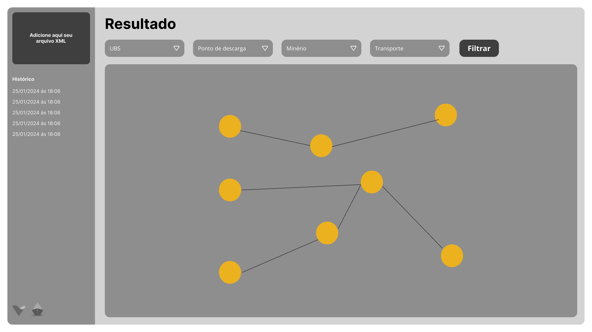
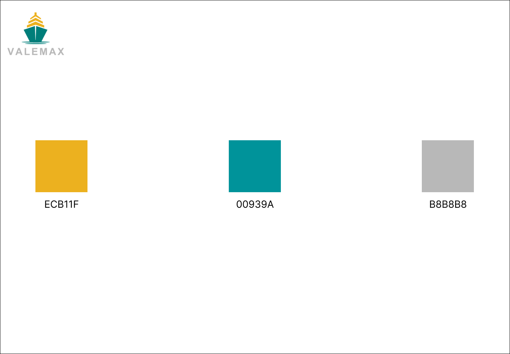
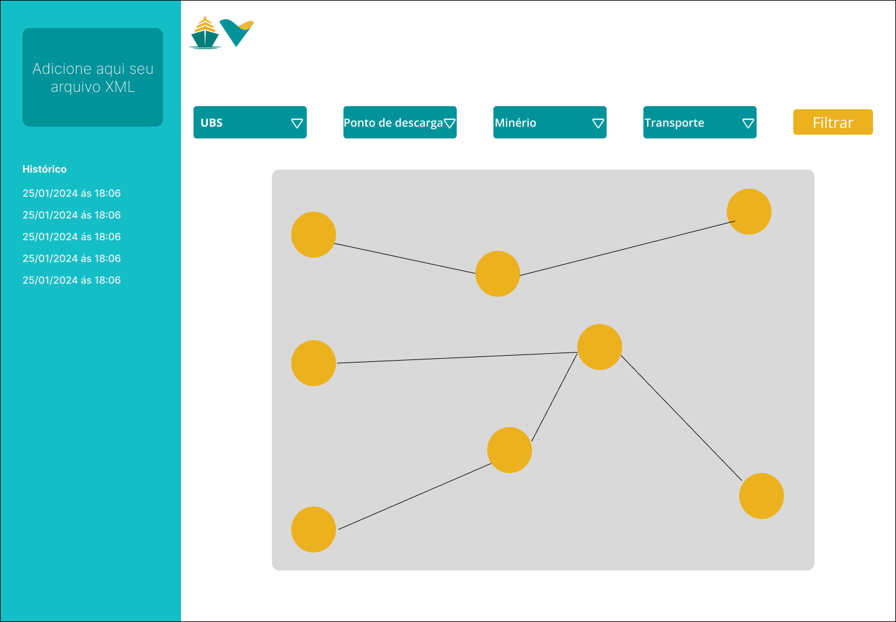
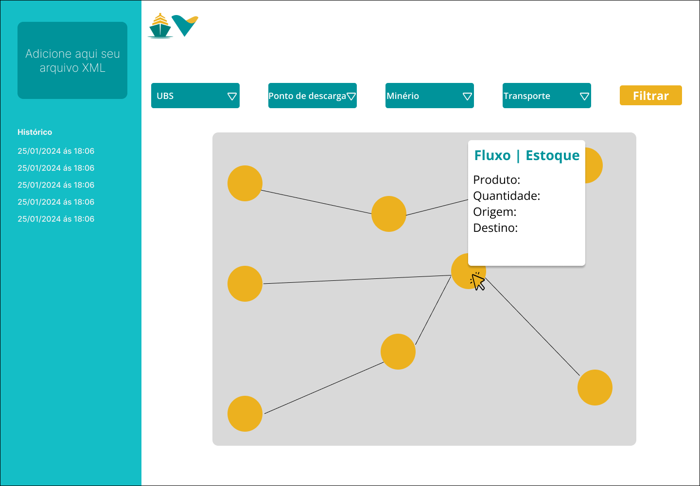

## _Wireframe_ 

&emsp;&emsp;Para desenvolver o _wireframe_ da interface visual proposta pela Valemax, foram feitos dois protótipos um de baixa fidelidade e um de alta. A interface em baixa fidelidade mostra apenas uma tela onde é possível adicionar um arquivo `XML` para que seja feita a análise de dados e, posteriormente, a geração do grafo. Além disso, é possível utilizar os filtros disponíveis para verificar percursos específicos. 

&emsp;&emsp;Antes de criar o wireframe de alta fidelidade analisamos a interface da Vale para desenvolvermos uma plataforma coesa com tal. Além disso, procuramos utilizar recursos interativos e com fácil UX. 

&emsp;&emsp;O desenvolvimento de _wireframes_ é uma etapa essencial para o desenvolvimento de qualquer projeto. O _wireframe_ traz uma representação simplificada da futura interface de usuário, apresentando-a de maneira compreensível aos _stakeholders_. Eles são fundamentais para a validação da estrutura e funcionalidade do projeto. Isso garante que os resultados finais sejam, não apenas acessíveis e funcionais, mas também estejam de acordo com o esperado pelos usuários finais.

&emsp;&emsp;Antes avançar para a criação do _wireframe_ de alta fidelidade, foi realizada uma análise minuciosa da interface da Vale. O objetivo era desenvolver uma plataforma que se integrasse harmoniosamente com o padrão estabelecido pela empresa. Além disso, foi priorizada a utilização de recursos interativos e uma experiência do usuário intuitiva, buscando garantir uma navegação fluida e acessível para os usuários.
 

   <b>Figura 1 -</b> Wireframe Baixa-Fidelidade

   

      </a>
   

   Fonte: Elaboração ValeMax (2024)

 

&emsp;&emsp;Antes de proceder ao _wireframe_ de alta fidelidade, foi realizada uma análise detalhada do site da Vale, objetivando desenvolver uma interface intuitiva e com recursos interativos, facilitando o manuseio do usuário que já está acostumado com a plataforma da empresa. O protótipo de alta fidelidade, portanto, incorporou elementos visuais com cores e de interação mais refinados, com o intuito de aproximar a representação ao produto final e oferecer uma experiência de usuário mais imersiva.

 

   <b>Figura 2 -</b> Guia de Cores

   

      </a>
   

   Fonte: Elaboração ValeMax (2024)

 

&emsp;&emsp;Agora, detalhando um pouco mais de cada tela:
 

   <b>Figura 3 -</b> Tela Grafo

   

      </a>
   

   Fonte: Elaboração ValeMax (2024)

 

**Tela Grafo-** À esquerda da tela é possível fazer a adição de um arquivo `XML` com os dados que deseja-se analisar, também é possível visualizar o histórico de arquivos que foram inseridos na plataforma pelo usuário. A parte central da tela representa a visualização do grafo com caminhos entre os portos, entrepostos e usinas de beneficiamento, é possível filtrar os tipos de viagem que o usuário deseja visualizar, com filtros de: usinas de beneficiamento, meios de transporte, pontos de descarga e tipos de minério.

 

   <b>Figura 4 -</b> Tela modal

   

      </a>
   

   Fonte: Elaboração ValeMax (2024)

 

**Tela Modal-** A tela do modal complementa a do grafo, porém quando o usuário passar ou clicar em um dos nós será possível visualizar informações sobre ele, como: fluxo, estoque, produto, quantidade, origem e destino.

&emsp;&emsp;Além disso, na implementação do _wireframe_, o objetivo é garantir a acessibilidade para todos os tipos de usuários. Para isso, as páginas foram projetadas com cores vibrantes e distintas, facilitando a diferenciação e a navegação. Optamos pela fonte Open Sans, que tem grande clareza e legibilidade, e por objetos intuitivos, garantindo que o _design_ seja não apenas agradável, mas também fácil de compreender e utilizar.
